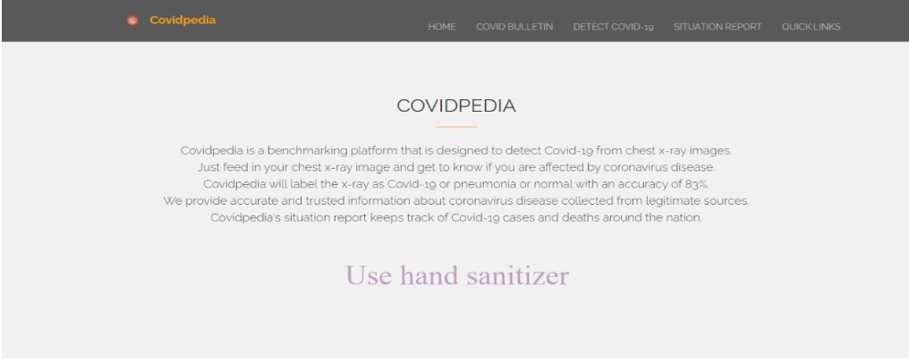
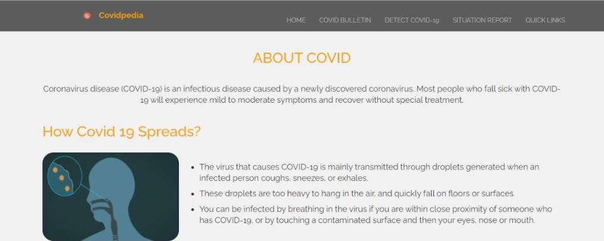
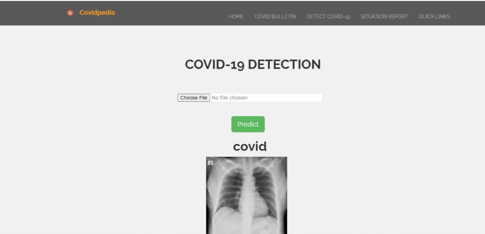
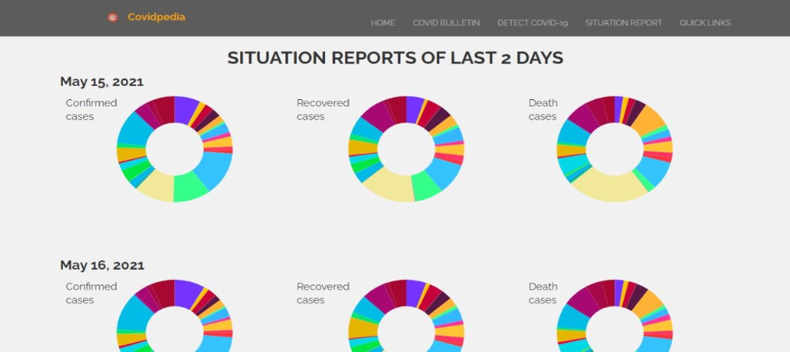
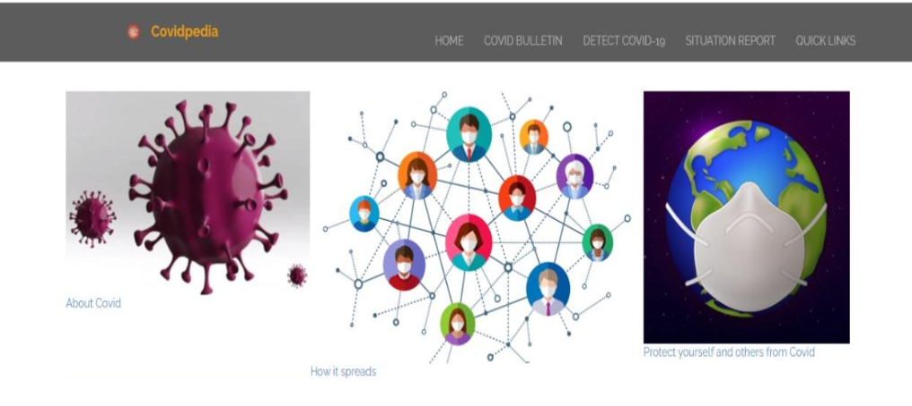

# COVIDPEIDA - Covid 19 Detection using X-Rays

Covidpedia is a benchmarking platform that is designed to detect Covid-19 from chest x-ray images.

### Publications:
- [SURVEY ON INTELLIGENT COVID-19 DETECTION FROM CHEST X-RAYS](https://www.irjet.net/archives/V8/i4/IRJET-V8I4998.pdf)
- [INTELLIGENT COVID-19 DETECTION FROM CHEST X-RAYS](https://www.irjet.net/archives/V8/i4/IRJET-V8I4999.pdf)